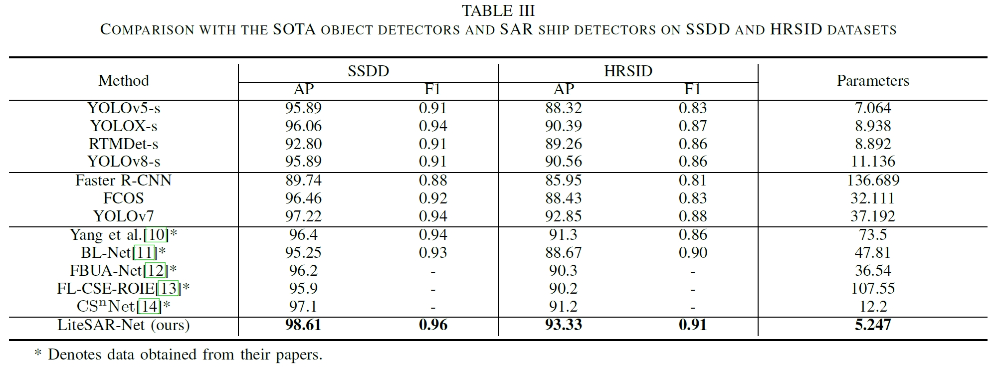

# A lightweight SAR ship detector using end-to-end image preprocessing network and channel feature guided spatial pyramid pooling
> [Chuxuan Chen*](https://pearlxuan233.netlify.app/), [Yimin Zhang*](https://yiminzhang.netlify.app/), Ronglin Hu**, [Yongtao Yu](https://scholar.google.com/citations?hl=en&user=sY1AFdAAAAAJ).
> <br>
>     * Equal Contribution
><br>
>** Corresponding Author [(huronglin@hyit.edu.cn)](huronglin@hyit.edu.cn)
><br>
>IEEE Geoscience and Remote Sensing Letters, 2024. [[doi](https://ieeexplore.ieee.org/document/10415050/keywords#keywords)]


The overall structure of the proposed **LiteSAR-Net**. The proposed **E2IPNet** will preprocess the input SAR images to improve the context information. Additionally, the designed **CFGSPP** is added to the backbone for better fusion of multiscale features and to avoid semantic information loss. The main contributions can be summarized as follows:

- An End-to-end Image Preprocessing Network (E2IPNet) is proposed to enhance the context features of targets for better detection of SAR ships in complex scenes.
- To prevent the loss of semantic information, a Channel Feature Guided Spatial Pyramid Pooling (CFGSPP) that can dynamically adjust its parameters by leveraging inter-channel information is proposed.
- Experiments conducted on SSDD and HRSID demonstrate that the proposed LiteSAR-Net achieves state-of-the-art performance.



### Citation

If you find this work useful, please cite our paper as:

```bibtex
@article{litesarnet,
  title={A lightweight SAR ship detector using end-to-end image preprocessing network and channel feature guided spatial pyramid pooling},
  author={Chen, Chuxuan and Zhang, Yimin and Hu, Ronglin and Yu, Yongtao},
  journal={IEEE Geoscience and Remote Sensing Letters},
  year={2024},
  publisher={IEEE}
}
```
